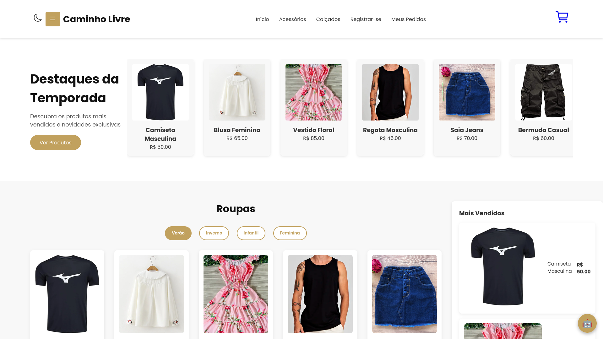

# Caminho Livre

<div class="d-flex gap-3">


</div>


Projeto de loja virtual de roupas e acessórios desenvolvido pelos alunos do curso técnico em Informática da **ETERJ** para a **FECIP 2025**.

O projeto conta com diferenciais de acessibilidade, incluindo modo escuro, layout responsivo e assistente virtual via chatbot FAQ integrado.

🌐 **[Acesse o Site](https://caminholivre.gt.tc)**  
📄 **[Relatório do Projeto (PDF)](relatóriofecip2025.pdf)**

---

## 🚀 Como Executar o Projeto Localmente

### 📋 Requisitos
* Ter um servidor web local instalado (como o [XAMPP](https://www.apachefriends.org) ou [Laragon](https://laragon.org)).
* Navegador moderno (Chrome, Edge, Firefox).

---

### 🔧 Passo a Passo

1. **Mova o Projeto para o Servidor Local:**
  * No **XAMPP**, coloque a pasta do projeto dentro de:  
    `C:\xampp\htdocs\caminholivre`
  * No **Laragon**, coloque dentro de:  
    `C:\laragon\www\caminholivre`

2. **Inicie os Serviços:**
  * Abra o painel do seu servidor (ex: XAMPP Control Panel) e clique em **Start** nos módulos **Apache** e **MySQL**.

3. **Importe o Banco de Dados:**
  * No navegador, acesse: [http://localhost/phpmyadmin](http://localhost/phpmyadmin).
  * Clique em **Novo** (New) e crie um banco com o nome: `caminho_livre`.
  * Selecione a base criada, vá na aba **Importar** (Import), selecione o arquivo `banco.sql` deste projeto e clique em **Executar**.

4. **Verifique o arquivo `config.php`:**
  * Renomeie o arquivo `config.example.php` do projeto para `config.php` e confirme se o usuário está como `root` e a senha em branco `""` (padrão do XAMPP).

5. **Acesse o Site:**
  * Digite no navegador este URL:
    ```
    http://localhost/caminholivre
    ```

---

### 🔑 Credenciais de Teste

| Perfil | E-mail | Senha | Funcionalidades |
| :--- | :--- | :--- | :--- |
| **Administrador** | `admin@caminholivre.com` | `admin123` | Gerenciar pedidos, adicionar/excluir produtos (`admin.html`) |
| **Cliente** | Crie via tela de registro | — | Navegar, adicionar ao carrinho, checkout e acompanhar pedidos |
